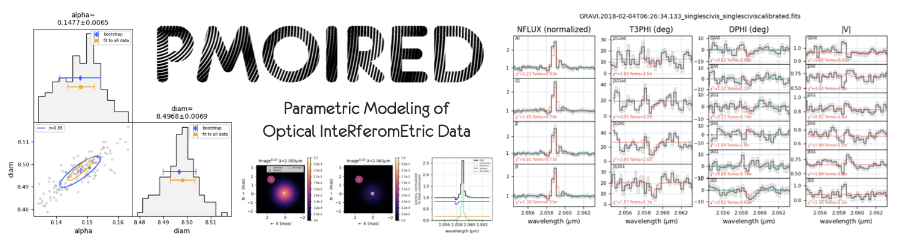
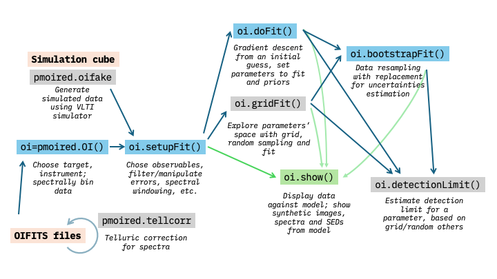

## Overview

`PMOIRED` is a Python3 module which allows to model astronomical spectro-interferometric data stored in the OIFITS format ([Duvert et al. 2017](https://ui.adsabs.harvard.edu/abs/2017A%26A...597A...8D/abstract)). Parametric modeling is used to describe the observed scene as blocks such as disks, rings and Gaussians which can be combined and their parameters linked. It includes plotting, least-square fitting and bootstrapping estimation of uncertainties. For spectroscopic instruments (such as GRAVITY), tools are provided to model spectral lines and correct spectra for telluric lines.

The modelling of data is based on several principles:
- The model is composed of a combination of basic building blocks (see the [model definition](Model%20definitions%20and%20examples.ipynb) notebook)
- Simple building blocks include uniform disks, uniform rings, Gaussians.
- Building blocks can be deformed (analytically), including stretched in one preferred direction, or slanted. This can efficiently simulate inclined components.
- More complicated blocks are available, such as disks/rings with arbitrary radial profile, and possibility to include azimuthal intensity variations.
- Each component has a spectrum, including modelling of emission or absorption lines (Gaussian or Lorentzian)
- In order for the computation to be fast (a requirement to perform data fitting), basic blocks have analytical or semi-analytical complex visibilities. Moreover, for the same reason, their spectral component is independent of the geometry.

The principles are close to tools such as [LITpro](https://www.jmmc.fr/english/tools/data-analysis/litpro). However, `PMOIRED` offers additional features:
- Modelling in the spectral dimension. For this reason, it contains a module to do basic telluric correction (only for VLTI/GRAVITY at the moment)
- Models' parameters can be expressed a function of each others, which allows to build complex geometrical shapes: astronomical realistic models can be build this way, without compromising on execution speed.
- Uncertainties can be estimated using bootstrapping (data resampling by date+telescope) to mitigate the effects of correlations between data.
- The values of parameters can be explored using grid and or random search.
- Synthetic data for VLTI array observations can be generated from data cubes.



## Install

### install with pip

`PMOIRED` is regularly pushed to PyPI at [https://pypi.org/project/pmoired/](https://pypi.org/project/pmoired/) so you can install directly using `pip`, by typing:

```
pip3 install pmoired
```
### install with git

To install from the github repository:
```
pip3 install git+https://github.com/amerand/PMOIRED
```
you can also clone the repository and install with `pip3 install .` within the PMOIRED directory

### uninstall
To uninstall (works for both PyPI and github versions):
```
pip3 uninstall pmoired
```

## Examples and tutorials

This repository comes with a [Jupyter Notebook showing basic model syntax](https://nbviewer.org/github/amerand/PMOIRED/blob/master/Model%20definitions%20and%20examples.ipynb).

Full examples, how to load real data and analyse them, are available in a separate repository: [PMOIRED_examples](https://github.com/amerand/PMOIRED_examples). These examples are Jupyter Notebooks reproducing published results with other tools, and serve both as tutorials and verification of `PMOIRED`. They cover most of the features of `PMOIRED`, from the basics to more advanced operations.

## Using and quoting `PMOIRED`

References to `PMOIRED` should point to the [2022 SPIE Telescopes+Instrumentation conference proceeding paper](https://ui.adsabs.harvard.edu/abs/2022SPIE12183E..1NM/abstract).

This code is a __research project in continuous development__ and not yet properly fully documented. If you want to get the best analysis for your data, do not hesitate to contact me: I try to be responsive, in particular with junior scientists. New features are driven by collaborations: if you think  `PMOIRED` is missing something, definitely contact me!

I maintain a list of works published using `PMOIRED` in a [curated bibliography](https://ui.adsabs.harvard.edu/public-libraries/dz7RG915Swq5yAB1KwmgTA).

> ***I used to to request co-authorship on publications using PMOIRED (until Feb 2023): this is no longer the case, unless I contributed directly to the work in question***

## Limitations and known issues

### Running a script in ipython hangs

PMOIRED uses the `multiprocessing` library to parallelise some computations (e.g. bootstrapping, grid search). This library has some issues if you run a script containing such computation is an interactive shell (using `%run` or `run` in ipython or Spyder). The provided examples as notebooks do not suffer from this problem. If you want to use PMOIRED in `.py` scripts you run in iPython, you should structure your `.py` script more or less as follow:
```
import pmoired
import matplotlib

matplotlib.interactive(True)
__spec__ = None
if __name__=='__main__':
    [code]
```
in iPython, you can now type `%run myscript.py`.

### Dependencies

The latest version of `PMOIRED` has been tested on:
- python 3.11.2
- numpy 1.24.2
- scipy 1.10.1
- astropy 5.2.1
- astroquery 0.4.6
- matplotlib 3.7.0
- jupyterlab 3.5.0
